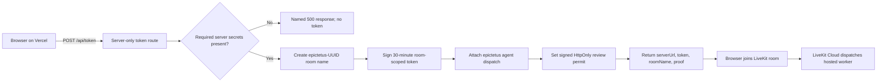
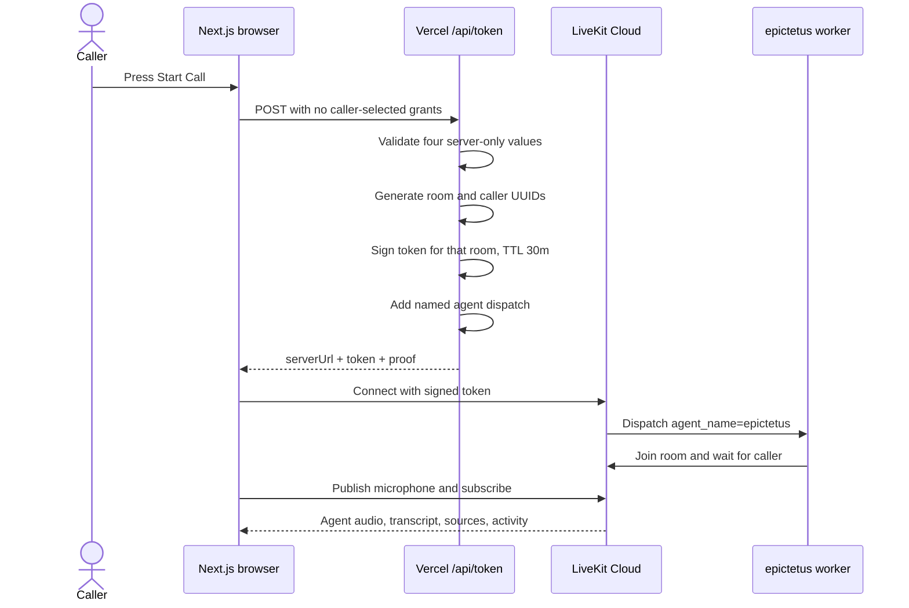
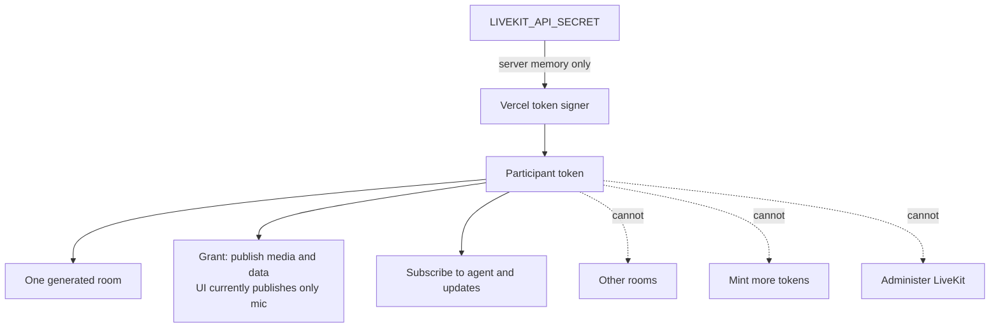
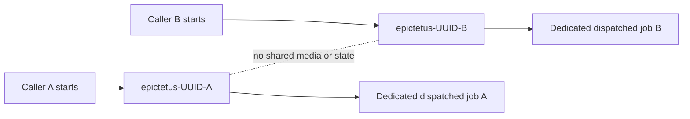
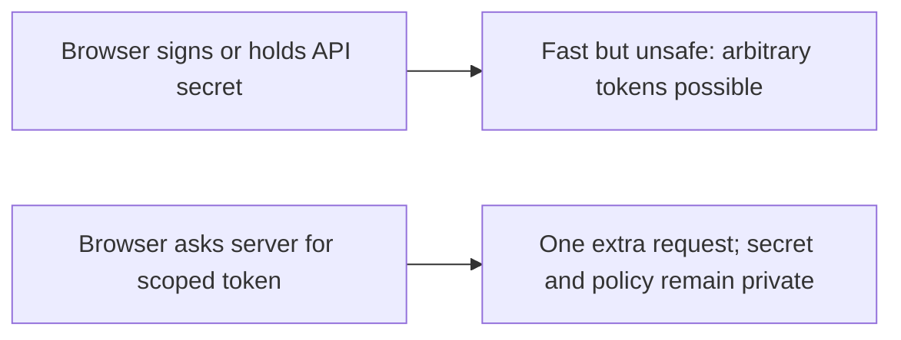
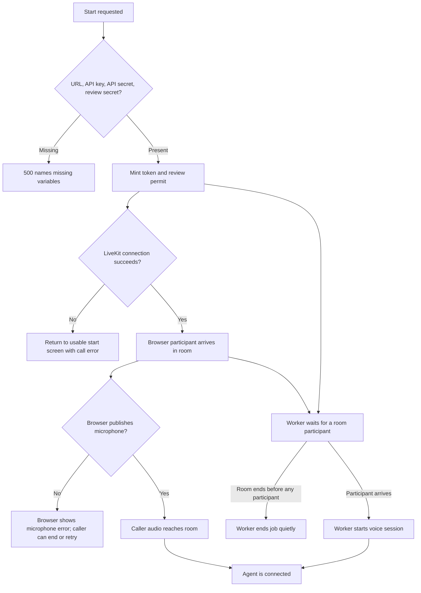

# Room setup and token permissions

This document explains the boundary between the public browser, the Vercel token
route, LiveKit Cloud, and the hosted Epictetus worker. The central rule is simple:
the browser receives authority scoped to one generated room and a limited
admission window, while the credential that can mint authority stays on the
server.

## What enters and what leaves

**Input:** an unauthenticated `POST /api/token` from the browser when the caller
presses **Start Call**.

**Output:** a LiveKit server URL, one signed participant token, a unique room
name, and a non-secret proof summary for the interface. The response also sets a
separate signed review-permit cookie used after the call.

The request body is deliberately ignored. The server chooses the room name,
participant identity, lifetime, grants, and agent dispatch. A caller therefore
cannot ask the route to mint a broader token.

Implementation: [`web/app/api/token/route.ts`](../../web/app/api/token/route.ts).

## The complete call-admission sequence

The token response is not itself proof that a room connection succeeded. The
browser records admission only after LiveKit connects. That separation prevents
the interface from calling a successful HTTP response a successful voice call.

## Permission boundary

The LiveKit API key and secret never enter browser JavaScript. They remain in
server-side environment variables and are used only by the Node.js token route.
The browser receives a participant token with these grants:

| Grant | Why it exists | What is deliberately absent |
|---|---|---|
| Join `epictetus-<uuid>` | Enter this call's room | No permission to choose or join another room |
| Publish | Send media tracks; the current interface publishes the microphone | No server or administration authority |
| Publish data | Granted by the current route, although the browser has no data-publish path today | No ability to mint credentials |
| Subscribe | Hear Epictetus and receive transcript/source updates | No access outside this room |

The route also asks LiveKit to dispatch only the worker registered as
`epictetus`. The same name appears in the Python worker registration. If those
names drift, the browser can enter a room but no agent will arrive, so the shared
name is a real contract rather than a label.

## Fresh room per call

Every request generates `epictetus-${crypto.randomUUID()}` and a separate caller
identity. This prevents two concurrent callers from being placed into the same
conversation by a reused static name.

The cost is deliberate: room state is not resumable. Leaving and starting again
mints another room and starts another in-memory session record. A future resume
feature would need an explicit server-side call identifier and state store; it
should not be built by weakening room isolation.

## Thirty-minute lifetime

The initial participant token has a 30-minute lifetime. LiveKit documents that
expiration affects initial connection, not an already connected session, and
that the server proactively refreshes tokens for connected clients so they can
reconnect after network loss. The TTL therefore limits the useful admission
window of an unused copied token; it does not impose a 30-minute call limit.

The route reports the lifetime in its non-secret proof object so the browser can
explain what was issued without decoding or displaying the JWT. Thirty minutes
is an assumption, not a usage-derived result. A production version should set it
from the expected delay between pressing Start and joining, balanced against the
acceptable exposure window for a copied unused token.

## Server-side signing and its latency cost

Signing on Vercel adds one HTTP request before WebRTC connection setup. That
extra step is the price of keeping the LiveKit secret out of a public bundle. It
also creates a single place to validate configuration, choose grants, dispatch
the worker, add review access, and log a non-secret room/identity pair.

No client-side cache can safely remove this request because every call needs a
fresh room name and token. The route declares itself dynamic for the same reason.

## Failure paths

- Missing server configuration returns a named error instead of a partial token.
- A minted token can still fail during WebRTC signaling or microphone setup; the
  UI treats that separately from successful token creation.
- If no participant reaches the room before it ends, the worker logs a normal
  early exit rather than reporting an application crash. It does not inspect the
  caller's microphone state; microphone errors belong to the browser path.
- Review access uses a separate 30-minute, HMAC-signed, HttpOnly cookie. It does
  not broaden the LiveKit token. The normal browser flow clears the cookie after
  a successful draft, but verification is stateless: a copied cookie value is
  not revoked server-side and remains replayable until expiry. The token route
  issues it before LiveKit connection, so it proves a token request, not a
  completed call.

## Choices and trade-offs

### Fresh room per call

**Benefit:** isolates media, transcript, tool activity, source updates, and the
in-memory call record by construction.

**Cost:** ending the call and pressing **Start Call** again begins a new session.
A network reconnect inside the existing LiveKit session is different: LiveKit
refreshes connected-client tokens for that path. Cross-call continuity would
require an explicit state design instead of accidental room reuse.

### Room scope and limited grants

**Benefit:** a participant token is useful only for one room and has no room
creation, listing, administration, recording, ingress, or SIP authority.

**Cost:** the implementation sets `canPublish: true` without
`canPublishSources`, so LiveKit permits media track sources beyond the microphone
even though the current interface uses only the mic. It also grants
`canPublishData: true`, while the current browser only subscribes to worker data
and has no data-publish path. The token is room-scoped and substantially narrower
than an API credential, but it is not strict source-level least privilege.
Adding `canPublishSources: ["microphone"]` and removing the unused data-publish
grant would tighten that boundary after client tests confirm the narrower token
still supports the call.

### Thirty-minute token

**Benefit:** an unused copied token has a limited window in which it can make an
initial connection.

**Cost:** shortening the window too far can reject a delayed initial join. It
does not end a long connected call because LiveKit handles connected-client
refresh.

### Server-side signing

**Benefit:** the credential capable of signing arbitrary access is not exposed to
the browser.

**Cost:** call startup includes one server round trip and depends on the token
route being available.

## Evidence

- Token policy, grants, TTL, dispatch, proof response, and missing-config logging:
  [`web/app/api/token/route.ts`](../../web/app/api/token/route.ts)
- Browser token request and LiveKit connection:
  [`web/call/experience/call-experience.tsx`](../../web/call/experience/call-experience.tsx)
- Matching worker registration and early-leave behavior:
  [`agent/main.py`](../../agent/main.py)
- Signed review permit and 30-minute lifetime:
  [`web/review/draft/access/review-access.ts`](../../web/review/draft/access/review-access.ts)
- Permit cookie attributes and normal browser clearing:
  [`web/review/draft/access/review-access-cookie.ts`](../../web/review/draft/access/review-access-cookie.ts)
- LiveKit's current token lifecycle and grant definitions:
  [Access tokens and grants](https://docs.livekit.io/frontends/reference/tokens-grants/)
