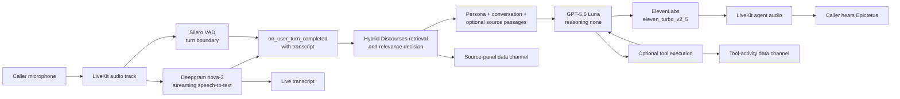
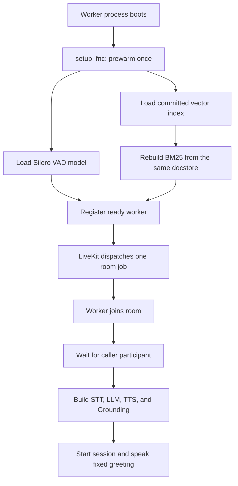
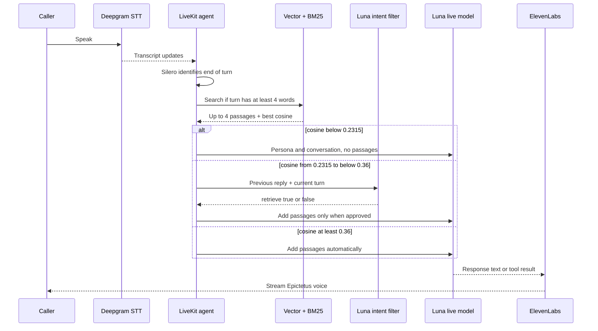
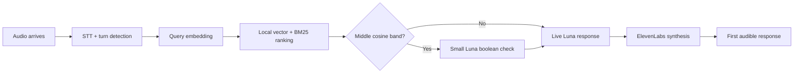
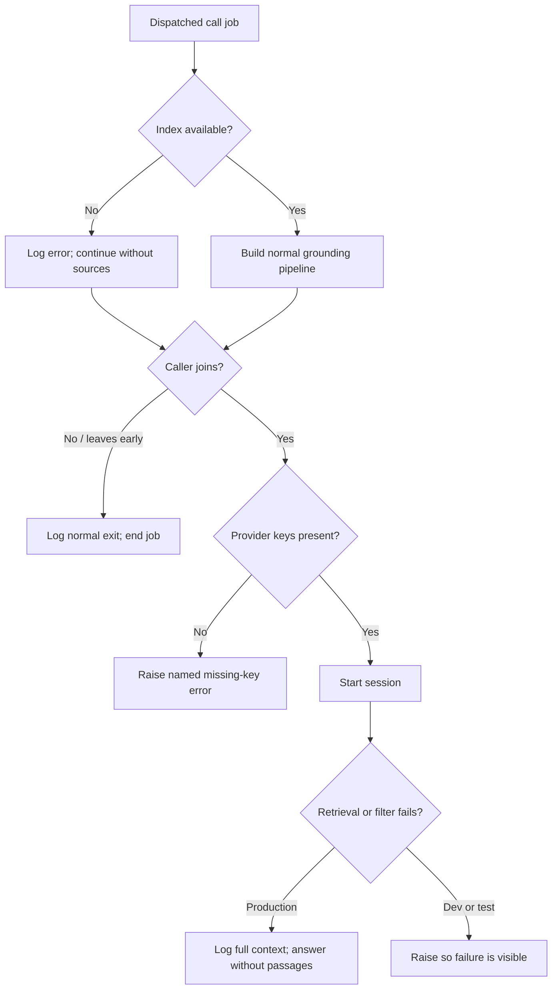

# Voice pipeline and latency choices

The voice worker is a long-running LiveKit agent, not a request/response function.
It registers once, waits for dispatch, joins a room, and keeps a real-time speech
pipeline alive for the duration of the call.

This document separates two kinds of statements:

- **Implemented facts** are visible in the current worker code.
- **Design intentions** explain why a provider or setting was chosen. The project
  has retrieval timing measurements, but it does not claim a measured end-to-end
  speech latency comparison between vendors.

## Pipeline at a glance

**Input:** the caller's microphone track in a LiveKit room.

**Output:** Epictetus's synthesized voice, a live transcript, source-panel
updates, and visible tool activity.

The four requested pipeline components are configured together in
[`agent/main.py`](../../agent/main.py):

| Role | Current choice | Current setting |
|---|---|---|
| Speech to text | Deepgram | `nova-3`, English |
| Language model | OpenAI | `gpt-5.6-luna`, reasoning `none`, temperature `0.75` |
| Text to speech | ElevenLabs | `eleven_turbo_v2_5`, configurable voice ID |
| Voice activity detection | Silero | loaded locally in worker prewarm |

## Worker startup versus call startup

The process has two distinct lifecycles. Expensive reusable state belongs in
process prewarm; room-specific state belongs in the dispatched job.

Prewarming avoids loading the local VAD model and reading the index after the
caller has already started speaking. The BM25 retriever is rebuilt from the
persisted vector index's docstore, so there is one committed copy of the corpus
rather than two stores that could drift.

If the index fails to load, the worker logs the full error and still registers
with a no-grounding implementation. The call can continue as a voice
conversation, but the source panel remains empty. This is a deliberate degraded
mode: conversational availability is preserved without pretending RAG worked.

## One spoken turn

Retrieval is moved to a worker thread because query embedding and index search
would otherwise block the Python event loop. The search embeds the question once
and reuses that vector for the vector retriever.

`preemptive_generation=True` is also enabled in the LiveKit session. It is an
implemented latency choice, but this repository does not present it as a measured
end-to-end gain. The retrieval hook runs after LiveKit marks the user turn
complete, so claims that retrieval itself executes while the caller is still
speaking would be stronger than the evidence.

## Where latency is spent

The measured part is retrieval ranking, not the complete chain:

| Evaluation | Questions | Recorded median retrieval time | Source |
|---|---:|---:|---|
| Chapter-derived | 53 | 252 ms in the later recorded run | `saved-results/rag-luna-filter-2026-07-31.md` |
| Hand-written spoken | 12 | 269 ms in the later recorded run | same |

The persisted JSON reports 267 ms and 295 ms from an earlier run of those same
question sets. Both are valid run snapshots; neither is an end-to-end call
latency measurement. The middle score band also adds a separate Luna call with a
three-second timeout and no retries.

## Provider choices and their trade-offs

### Deepgram for speech to text

Deepgram `nova-3` was selected for a streaming voice path where responsiveness
and operating cost matter. Those are design reasons, not a benchmark against all
available speech providers in this repository.

**Trade-off:** speech recognition and synthesis use different providers. That
adds two SDKs, two credentials, two failure surfaces, and separate usage limits.

### GPT-5.6 Luna for the live agent

The live model runs with reasoning set to `none`. The intent is to keep the
spoken loop responsive while retaining enough ability to hold the persona, use
two narrow tools, and reason about a caller's situation.

**Trade-off:** the live turn prioritizes response time and cost over maximum
reasoning depth. The design does not spend higher reasoning effort on every
sentence a caller must wait to hear.

### ElevenLabs for Epictetus's voice

The worker uses ElevenLabs' `eleven_turbo_v2_5` model. The selected voice ID comes
from an environment variable, because choosing the right older, low, unhurried
voice is a listening decision and should not require a code change.

**Trade-off:** ElevenLabs adds another provider and can become the practical
usage limit through synthesized characters. The chosen model is the fast tier,
but voice fit was valued over collapsing STT and TTS into one vendor.

### Silero for voice activity detection

Silero runs inside the worker, so deciding when speech ended does not require a
separate network request.

**Trade-off:** the worker must load and hold another model. Prewarming moves that
work before dispatch, but it still increases the worker image and startup work.

### Prewarming the VAD and index

Prewarm makes reusable models available before the room job begins.

**Trade-off:** a new worker takes longer and uses more memory before it can accept
a call. The payoff is avoiding that setup inside the first conversational turn.

### Higher reasoning only after the call

The editable review uses the same Luna model with reasoning effort `high`, while
the live agent uses `none`. Review generation is outside the spoken loop, so a
short delay is acceptable and careful commitment handling matters more.

**Trade-off:** the review costs more and can take longer. It is protected by a
short-lived permit, size limits, and rate limiting rather than made available as
an unrestricted public model endpoint.

## Error and recovery behavior

The difference between production and local failure handling is intentional.
Production keeps an active voice call alive if the retrieval intent check fails;
development and tests raise the same failure so it cannot pass unnoticed.

## Evidence

- Provider settings, prewarm, named key validation, session construction, and
  hosted-worker lifecycle: [`agent/main.py`](../../agent/main.py)
- Turn-completion hook and tool execution:
  [`agent/persona/epictetus_agent.py`](../../agent/persona/epictetus_agent.py)
- Off-event-loop retrieval and three-way decision:
  [`agent/grounding/turn_rag.py`](../../agent/grounding/turn_rag.py)
- Single query embedding and local hybrid ranking:
  [`agent/retrieval/search/passage_search.py`](../../agent/retrieval/search/passage_search.py)
- High-reasoning structured review:
  [`web/review/draft/openai-review.ts`](../../web/review/draft/openai-review.ts)
- Measured retrieval runs:
  [`saved-results/rag-luna-filter-2026-07-31.md`](../../saved-results/rag-luna-filter-2026-07-31.md)
