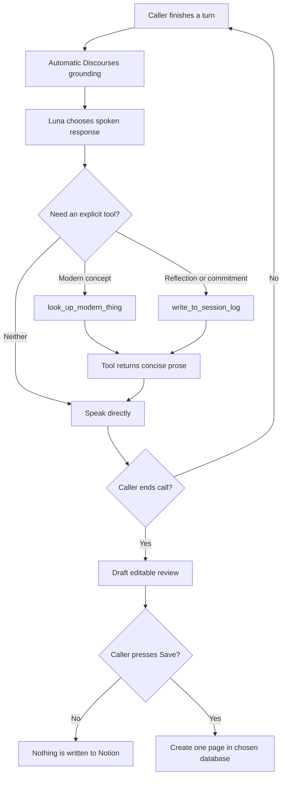
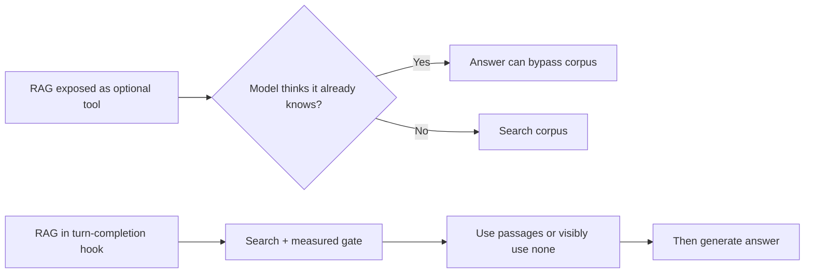
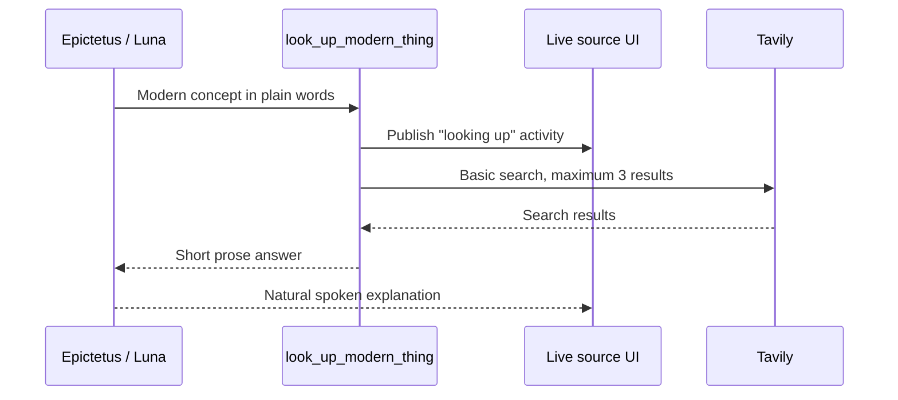
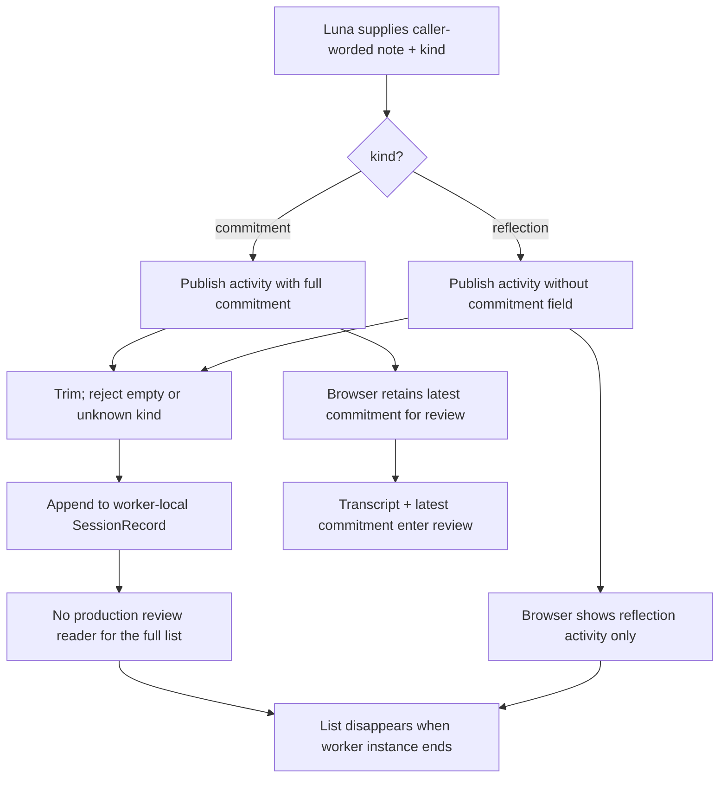
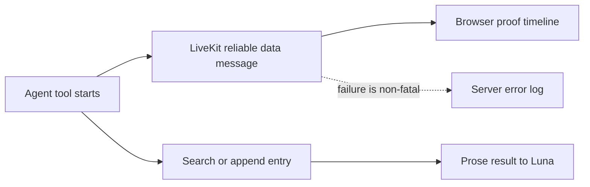
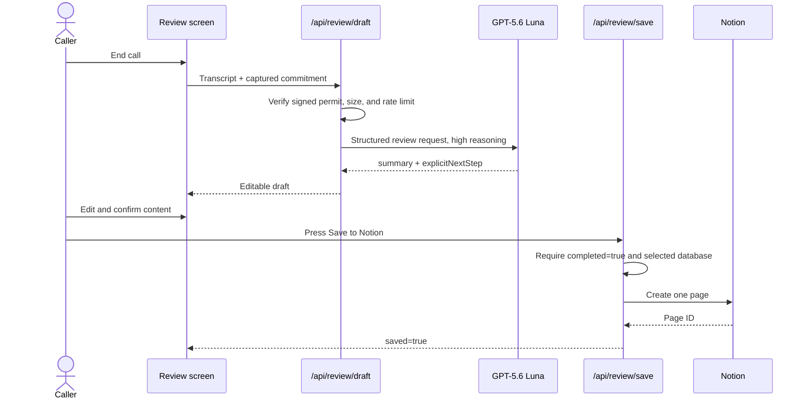
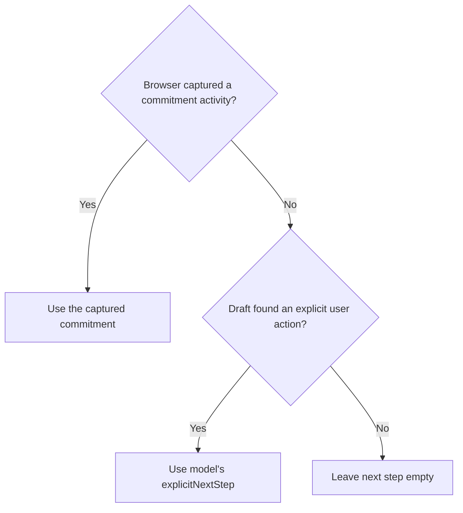
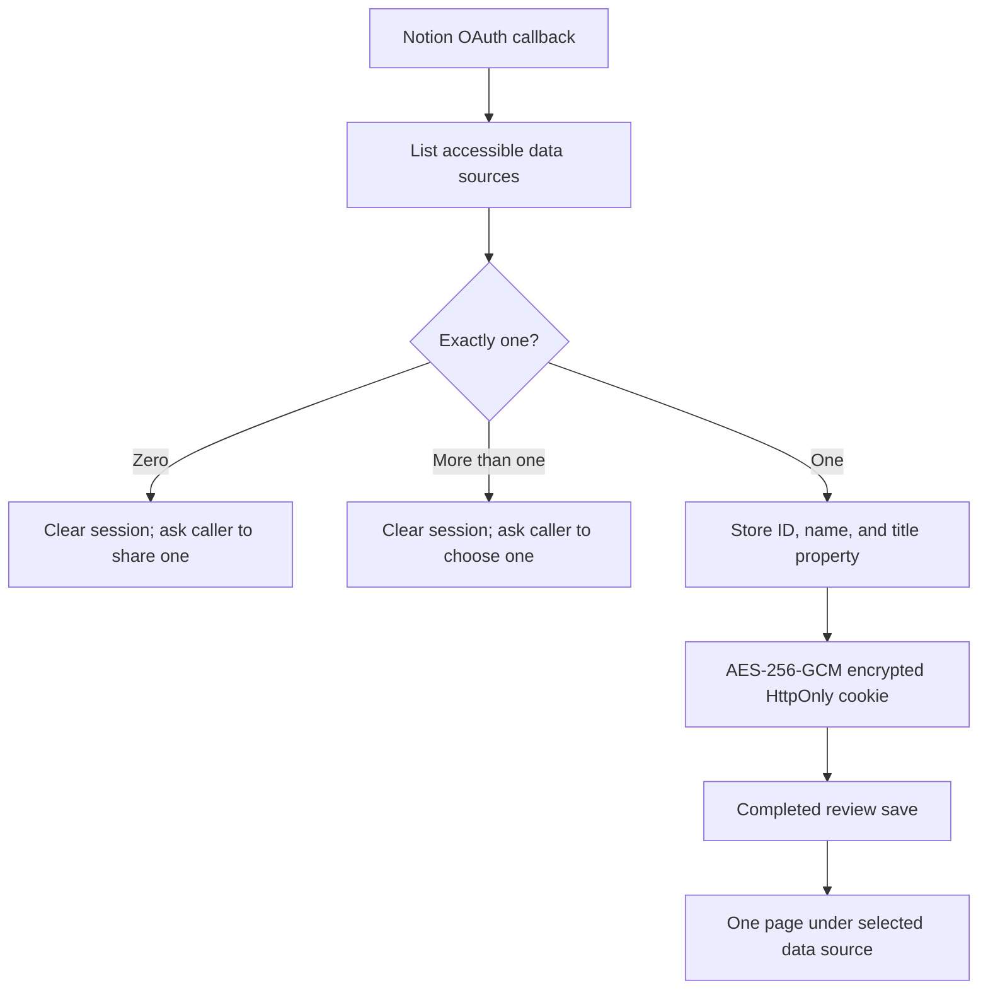
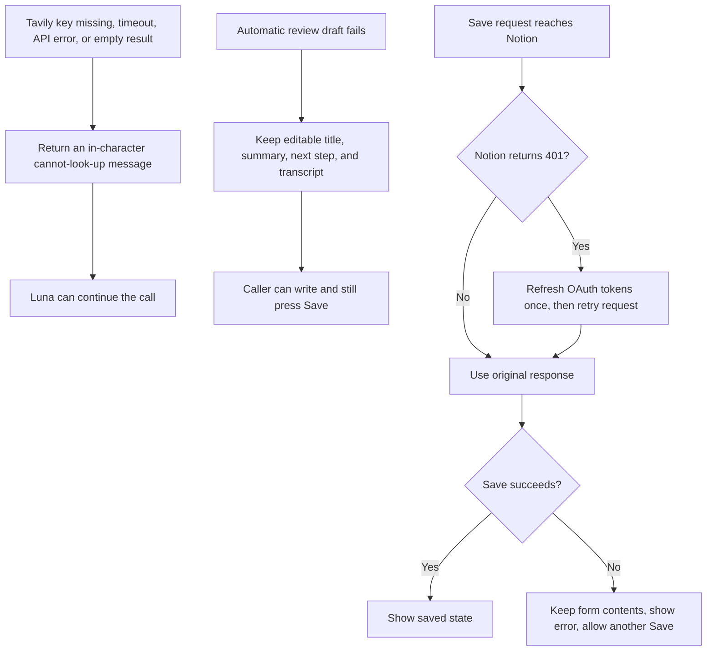

# Agent tools, call log, and Notion review

Epictetus has two explicit tools and one automatic grounding path. Keeping those
separate is the main design choice:

- RAG is required evidence and runs before every substantive answer.
- Tools represent actions the historical Epictetus could not perform from his
  own knowledge: understand a modern concept or record the caller's own words.
- Notion is not an agent tool. It is a user-approved export after an editable
  review.

## Why RAG is not a tool

The model may already know Epictetus and could produce a plausible answer without
calling a retrieval tool. That would make a demo sound correct while bypassing
the system being evaluated. Instead, LiveKit calls `on_user_turn_completed`
before the response model runs; that hook performs the relevance decision and
adds any retained passages to the context.

Automatic retrieval adds work to the ordinary turn path. The four-word check,
cosine floor, and Luna intent check prevent greetings, thanks, connection checks,
and modern tool requests from dragging irrelevant philosophy into the prompt.
The detailed retrieval design is in
[`rag-retrieval-fusion-thresholds-and-evidence.md`](rag-retrieval-fusion-thresholds-and-evidence.md).

## Tool 1: understand a modern concept

`look_up_modern_thing` sends a plain-language query to Tavily. Its purpose is not
general autonomous browsing; it gives a second-century persona enough current
context to understand things such as a performance review, a modern job, or a
service before responding.

The tool uses a six-second request timeout and asks Tavily for at most three basic
results. The result is converted to prose before it returns to the model.

### Why prose rather than raw JSON

A voice response needs a sentence the model can use naturally. Returning a raw
object risks the model narrating field names or list structure aloud. Concise
prose keeps the tool result aligned with the spoken interface.

**Trade-off:** prose is harder for downstream code to validate, filter, or render
as a structured object. If this result later drives UI cards or automated
actions, a better boundary would return validated structured data to the app and
derive separate prose for the voice model.

## Tool 2: keep a record of this call

`write_to_session_log` stores one ordered entry tagged as either `reflection` or
`commitment`. The record is created when the agent instance is created, so each
call starts empty.

The tool instruction says to record what the caller said, in the caller's words,
rather than turning the agent's advice into a commitment. This matters because a
generated recommendation and a promise by the user are not the same fact.

### What is and is not retained

The full ordered `SessionRecord` is worker-local and the production review path
does not read it. It disappears with the agent instance whether or not the
caller saves a review. Activity messages make both kinds visible during the
call, but only a `commitment` activity carries the full commitment field that
the browser retains for the review. A `reflection` has no separate structured
path into the review or Notion; it can still appear in the transcript because
the caller said it aloud.

That boundary avoids silently carrying sensitive reflections into a future
conversation. The only durable artifact is the caller-edited review they
explicitly save to Notion.

**Trade-off:** the next call has no automatic continuity or personalization.
Useful context from Epictetus's side is also not stored as durable memory. The
review may therefore be less complete than a full agent-authored memory, but it
is less likely to overstate advice, invent a conclusion, or make a suggestion
look like a promise the caller made.

## Visible tool activity

Before either tool performs its work, the worker publishes a small JSON activity
message on `epictetus.activity`. The browser can show which tool fired instead of
asking a reviewer to trust an invisible server log.

The activity payload contains an action, a detail truncated to 120 characters,
an optional kind, and the full commitment only when the entry is actually tagged
`commitment`. Publishing failure is logged with full context but does not end the
call.

## From call to editable review

Ending the call does not immediately write to Notion. It sends the transcript and
captured commitment to a protected server route, which asks Luna for a structured
draft. The caller can edit the title, summary, next step, and transcript before
saving.

It is precise to say **nothing is written to Notion before Save**. It would be
incorrect to say the review is not sent anywhere before Save: the transcript is
sent to OpenAI when the editable draft is generated.

## Review drafting rules

The draft request uses GPT-5.6 Luna with high reasoning effort and a strict JSON
schema containing `summary` and `explicitNextStep`. The instruction requires an
empty next step when the transcript contains no explicit user commitment.

The final next step follows this priority:

This gives the explicit in-call record priority over the after-call inference.
Higher reasoning is reserved for review because the user is no longer waiting
for every word to be synthesized live.

The public draft route also:

- requires a signed 30-minute review permit issued with the room-token response,
  before the browser connects;
- accepts no empty transcript;
- caps transcripts at 60,000 characters and captured commitments at 2,000;
- allows three attempts per forwarded network address per hour in the process-local limiter;
- clears the permit cookie in the normal browser after a successful draft;
- stores neither the model response nor a standing review session in OpenAI.

Clearing the cookie prevents the normal browser flow from drafting twice. The
permit itself is a stateless signed value, so a copied value remains replayable
until its 30-minute expiry. It proves only that the token route issued admission;
it does not prove that the browser connected or that a call was completed.

The in-process rate limiter is one layer, not a complete distributed production
limit. Multiple server instances do not share its map, so deployment-level rate
limiting remains the outer protection.

## Notion connection and save boundary

Each caller connects their own Notion workspace with OAuth and must share exactly
one accessible database. The app detects that database's existing title property
and writes a page without changing the schema.

The page body contains:

1. Summary
2. Next step
3. Chapters referenced
4. Transcript

Long rich-text fields are split into blocks below Notion's per-block limit. The
Notion access and refresh tokens are encrypted with AES-256-GCM in an HttpOnly,
SameSite=Lax cookie. They are not placed in LiveKit participant metadata or made
available to browser JavaScript.

The latest combined production proof exercised the review draft but deliberately
did not claim a real Notion save because no Notion session was connected in that
run. The save path is covered by route and storage tests; that distinction keeps
test evidence separate from live integration evidence.

## Failure and recovery paths

The optional integrations fail without destroying the caller's review or live
conversation:

## Choices and trade-offs

### Two narrow tools

**Benefit:** both tools have a clear narrative reason and a limited effect. Tavily
supplies missing modern context; the log records only this caller's reflections
and commitments.

**Cost:** the agent cannot take arbitrary external actions. It is primarily an
adviser rather than a general operator. That reduces direct utility, but it also
fits the historical character: Epictetus helps a person reason and choose an
action rather than silently acting on their accounts.

### User wording instead of agent advice

**Benefit:** the permanent-looking next step is anchored to something the caller
actually said.

**Cost:** the record can be less polished and omit useful context from the
agent's side of the discussion.

### Editable review before persistence

**Benefit:** the caller sees and can correct the artifact before it becomes a
Notion page.

**Cost:** saving takes another interaction and a caller may abandon the draft.
The system deliberately prefers missed persistence over unwanted persistence.

### High reasoning after the call

**Benefit:** more effort is spent where faithful summarization and commitment
handling matter and immediate spoken latency does not.

**Cost:** the review takes longer and costs more than a no-reasoning generation.

## Evidence

- Automatic grounding hook, two tools, prose returns, and activity publication:
  [`agent/persona/epictetus_agent.py`](../../agent/persona/epictetus_agent.py)
- In-memory entry validation and ordering:
  [`agent/session/record.py`](../../agent/session/record.py)
- Tavily request shape and timeout:
  [`agent/tools/modern_world/web_search.py`](../../agent/tools/modern_world/web_search.py)
- End-call review source and commitment capture:
  [`web/call/review/flow/call-review-flow.ts`](../../web/call/review/flow/call-review-flow.ts)
- Structured high-reasoning draft:
  [`web/review/draft/openai-review.ts`](../../web/review/draft/openai-review.ts)
- Draft access, limits, and normal-browser permit clearing:
  [`web/app/api/review/draft/route.ts`](../../web/app/api/review/draft/route.ts)
- Permit lifetime and stateless signature validation:
  [`web/review/draft/access/review-access.ts`](../../web/review/draft/access/review-access.ts)
- Draft and save failure behavior in the editable review:
  [`web/call/review/review-screen.tsx`](../../web/call/review/review-screen.tsx)
- Completed-review check and Notion page creation:
  [`web/app/api/review/save/route.ts`](../../web/app/api/review/save/route.ts)
- Notion page structure:
  [`web/review/storage/notion-review.ts`](../../web/review/storage/notion-review.ts)
- One-time Notion refresh and retry after a 401:
  [`web/notion/connection/client/notion-client.ts`](../../web/notion/connection/client/notion-client.ts)
- Encrypted Notion session:
  [`web/notion/connection/session/session.ts`](../../web/notion/connection/session/session.ts)
