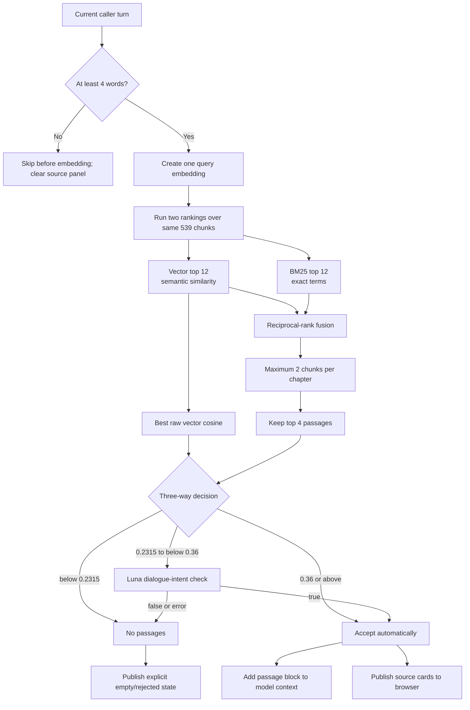
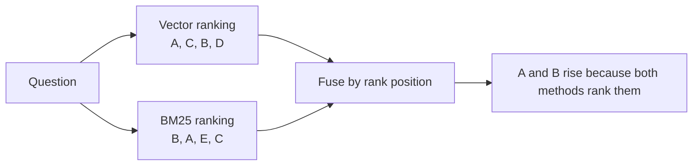
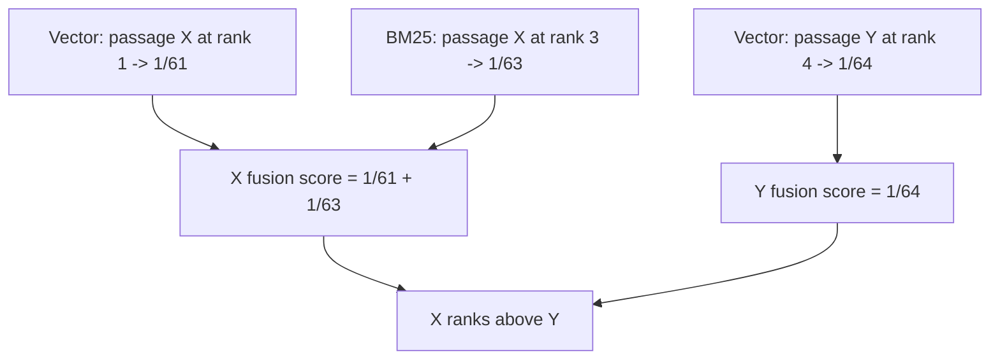
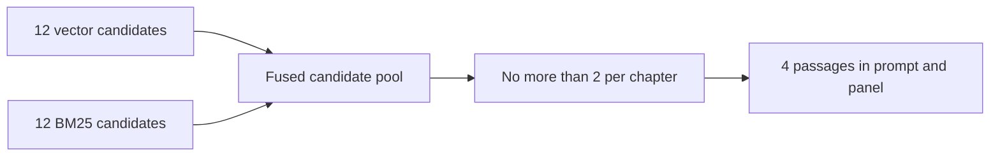
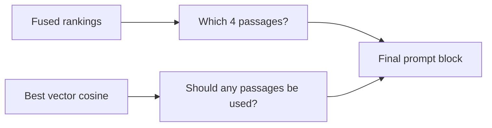
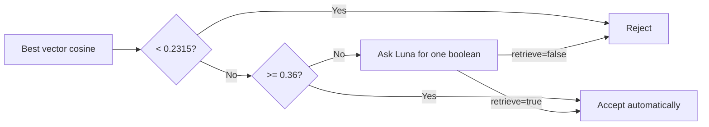
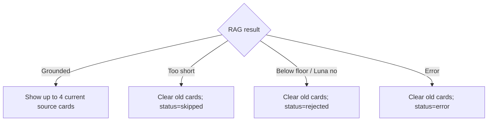
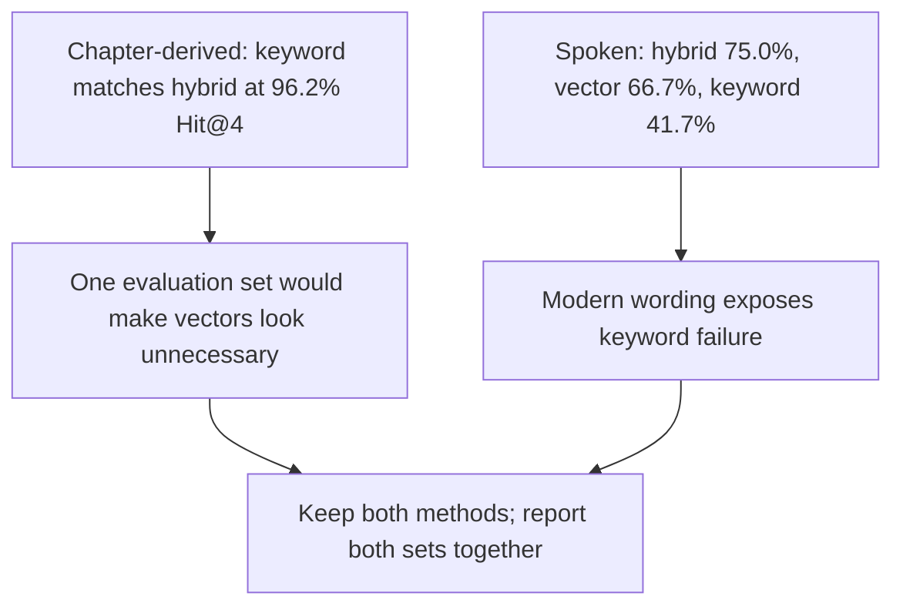

# RAG retrieval, fusion, thresholds, and evidence

The retrieval system is designed around the hardest sentence in the take-home:
the evaluator may ask for a specific fact from a specific chapter. It therefore
preserves chapter identity from PDF parsing through chunking, ranking, prompt
construction, and the visible source panel.

The complete system has two parts:

1. An offline build turns the PDF into a committed vector store.
2. A live decision retrieves passages for each substantive caller turn.

## Offline corpus and index build

The source of truth is `corpus/discourses.pdf`, not a hidden text file. The
parser reads the PDF back into 95 chapters across four books before chunking.


Chapter boundaries are hard walls: the splitter is called once per chapter. A
chunk can never contain the end of one chapter and the beginning of another,
which would make its citation ambiguous. Book and chapter numbers are stored as
metadata but excluded from the embedded text, preventing a number in a question
from pulling a passage merely because its citation contains the same number.
Every chunk in a chapter receives that chapter's `start_page`; it is a chapter
locator, not the exact physical PDF page on which that chunk's text appears.

The vector index is persisted. BM25 is rebuilt from the same docstore when the
worker loads, avoiding a second stored copy of the corpus that could drift. A
remote vector database was not used because the fixed corpus is only 539 chunks;
at this size a database would add a service, network request, and bill without
solving a scaling problem the project has.

## Live retrieval flow



The query embedding is computed once. The vector retriever uses it for semantic
ranking; the same query text goes to BM25 for lexical ranking.

## Why hybrid search

Vector and keyword retrieval fail on different language:

- **Vector search** connects a modern description to a semantically similar
  ancient argument even when the vocabulary differs.
- **BM25** is strong when a question names a rare object, person, or phrase, such
  as the iron lamp used in a specific chapter.

The two raw scores cannot be added. Cosine similarity and BM25 relevance use
different scales, so a larger number from one system does not mean the same thing
as a larger number from the other.



## Reciprocal-rank fusion

Each ranking contributes:

```text
contribution = 1 / (60 + rank)
```

A passage at rank 1 contributes `1/61`; rank 2 contributes `1/62`. If the same
passage appears in both lists, the contributions add. The result values stable
placement across both methods rather than the incompatible magnitude of either
raw score.



`k = 60` is the standard smoothing value used by this implementation. Fusion
rank determines which passages survive; it does **not** decide whether the
corpus is relevant enough to use.

## Candidate width and prompt size

Each retriever returns 12 candidates. Fusion combines that wider pool, then the
system keeps four passages with at most two from any one chapter.



This gives both search methods enough opportunity to contribute without putting
all candidate text into a latency-sensitive voice prompt. The per-chapter cap
also stops one long chapter from occupying every slot.

**Trade-off:** a third useful chunk from the correct chapter can be excluded, and
four passages can contain a lower-ranked distraction. The candidate count, top
count, and chapter cap were not tuned after the first benchmark passed; sweeping
them against 53 author-generated questions would risk fitting the system to its
own evaluation set.

## Why the gate uses raw cosine

Reciprocal-rank fusion measures ordering, not absolute relevance. Its top score
looks similar whether the best passage is a perfect match or merely the least
bad item in an irrelevant query. The gate therefore uses the maximum raw cosine
from the vector ranking.



This is also why the project implements the fusion arithmetic directly instead
of using a wrapper that discards the component vector scores.

## The three-way relevance rule



The ranges are:

| Best cosine | Action | Reason |
|---:|---|---|
| `< 0.2315` | Reject | Below the measured floor for the weakest required production turn |
| `0.2315 <= score < 0.36` | Ask Luna about dialogue intent | Topic similarity overlaps with acknowledgements and tool-style requests here |
| `>= 0.36` | Accept automatically | Strong enough to avoid another model call |

The middle-band filter sees only the previous Epictetus reply and current user
turn. It returns a structured boolean with GPT-5.6 Luna, reasoning disabled, a
16-token output limit, response storage disabled, a three-second timeout, and no
automatic retries.

The filter is answering a dialogue question that cosine cannot: does this turn
add a substantive personal or philosophical issue, or is it an acknowledgment,
sign-off, connection check, or modern-tool request?

## Why four words is the first gate

Turns with fewer than four whitespace-separated words skip retrieval before an
embedding request. “Yeah,” “okay thanks,” and “hold on” do not contain enough new
content to justify searching a book.

**Trade-off:** a genuine short question such as “Why?” does not run a new search.
It relies on the previous conversation context, which is also where the meaning
of that question lives.

## Source-panel truthfulness

The agent publishes both positive and negative RAG decisions. When passages are
used, the browser receives citations, titles, chapter start pages, passage text,
the score, and the decision. When retrieval is skipped, rejected, or fails, the
worker publishes an empty source list with the corresponding status.



Clearing matters. Leaving the previous answer's chapter visible during an
unrelated response would create a false citation even if the model prompt was
correct.

The prompt block intentionally omits book and chapter numbers. Epictetus speaks
from the passage in character; the separate browser panel carries the citation.

## Evaluation design

The ranking evaluation disables the relevance gate for each search variant so
hybrid, vector-only, and keyword-only are compared on ranking rather than having
one variant's score scale filtered differently.

Two sets are required because they measure different language:

1. **53 chapter-derived questions.** These use specific people, objects, and
   examples from the source. They match the evaluator's “specific fact in a
   specific chapter” test, but they also favor keyword search.
2. **12 hand-written spoken questions.** These describe modern personal problems
   without borrowing the chapter's rare words. Their labels are the builder's
   judgment, and several questions could reasonably map to more than one chapter.

### Ranking results

| Set | Search | Hit@1 | Hit@3 | Hit@4 | MRR |
|---|---|---:|---:|---:|---:|
| Chapter-derived (53) | Hybrid | 86.8% | 96.2% | **96.2%** | 0.912 |
|  | Vector only | 75.5% | 88.7% | 90.6% | 0.822 |
|  | Keyword only | 88.7% | 96.2% | **96.2%** | 0.921 |
| Spoken (12) | Hybrid | 41.7% | 58.3% | **75.0%** | 0.528 |
|  | Vector only | 50.0% | 66.7% | 66.7% | 0.583 |
|  | Keyword only | 8.3% | 33.3% | **41.7%** | 0.201 |

Hit@4 is the main metric because all four retained passages reach the response
model. On the spoken set, vector-only has higher MRR while hybrid has higher
Hit@4: vector ranks fewer correct chapters somewhat earlier, while hybrid finds
more correct chapters within the full prompt budget.



### Current gate evidence

The former `0.36`-only threshold is historical. A later seven-turn conversation
contained five relevant turns scoring from `0.2315` to `0.3376`, while a closing
acknowledgment scored `0.2451` in exact replay and `0.2473` after punctuation
cleanup. One cosine threshold could not separate them.

In the recorded real-index and real-Luna pipeline:

- five required turns were retained with four visible passages each;
- one optional turn and the closing acknowledgment were rejected;
- connection-check, calendar-request, and journal-request controls were rejected;
- the low-scoring “walk away” turn surfaced Book 4, Chapter 1, *About Freedom*.

That is direct evidence for the middle-band intent check. It is not a broad
production-accuracy guarantee.

## Limits and honest claims

- Twelve spoken questions is a small set, and the gold chapters are the
  builder's judgment. Use its percentages as comparative evidence, not a general
  accuracy claim.
- The 53 generated questions borrow source vocabulary and flatter keyword
  search. Always report their 96.2% Hit@4 beside the 75.0% spoken result.
- One spoken question about a cancelled flight scores `0.1925` and remains below
  the floor. Modern concrete nouns with little abstract vocabulary are a known
  miss.
- The thresholds are tied to this corpus and embedding model. A different PDF,
  chunking policy, or embedding model must re-measure them.
- A middle-band turn adds another model call and can time out. Production logs
  the error and continues ungrounded rather than ending the voice call.
- The benchmark measures retrieval, not whether every final spoken answer is
  philosophically correct or useful.

## Reproduce the ranking measurements

The committed index avoids a rebuild. With the project environment configured:

```bash
.venv/bin/python eval/run_retrieval_eval.py
.venv/bin/python eval/run_retrieval_eval.py --questions eval/spoken_questions.json
.venv/bin/python eval/run_retrieval_eval.py --only vector
.venv/bin/python eval/run_retrieval_eval.py --only keyword
```

Use `--report <path>.json` to keep per-question scores. The saved comparison and
the later two-stage decision evidence are linked below.

## Evidence

- PDF parsing and chapter identity:
  [`agent/retrieval/parse_pdf.py`](../../agent/retrieval/parse_pdf.py)
- Chapter-bounded 400-token chunks with 60-token overlap:
  [`agent/retrieval/chunking.py`](../../agent/retrieval/chunking.py)
- Committed file-backed vector index:
  [`agent/retrieval/search/index_store.py`](../../agent/retrieval/search/index_store.py)
- Hybrid search, candidate widths, fusion, chapter cap, cosine floor:
  [`agent/retrieval/search/passage_search.py`](../../agent/retrieval/search/passage_search.py)
- Four-word check, three-way decision, and source publication:
  [`agent/grounding/turn_rag.py`](../../agent/grounding/turn_rag.py)
- Luna intent filter contract:
  [`agent/grounding/turn_filter/luna.py`](../../agent/grounding/turn_filter/luna.py)
- Full ranking table and parameter history:
  [`saved-results/retrieval-parameters.md`](../../saved-results/retrieval-parameters.md)
- Current two-stage filter and real-pipeline evidence:
  [`saved-results/rag-luna-filter-2026-07-31.md`](../../saved-results/rag-luna-filter-2026-07-31.md)
- Raw saved runs:
  [`saved-results/retrieval-eval.json`](../../saved-results/retrieval-eval.json) and
  [`saved-results/retrieval-eval-spoken.json`](../../saved-results/retrieval-eval-spoken.json)
